# SBARDEF HUD MOD FOR WOOF!

The Nightdive port brought the possibility to edit the Doom statusbar and fullscreen HUD via <a href="https://doomwiki.org/wiki/SBARDEF" target= "_blank">SBARDEF</a>. I couldn't wait for the availability of a proper editor and went ahead to create the HUDs I wanted, using nothing but Notepad.  
**If you want to use any (or all) of these HUDs in a mod of yours, feel free to do so. However, please be fair and credit me for my work. A lot of effort and time has been invested into this project.**  

**Intended ports:**
- <a href="https://github.com/fabiangreffrath/woof" target= "_blank">Woof!</a> (mod has been primarily developed for this port) 
- <a href="https://github.com/MrAlaux/Nugget-Doom" target= "_blank">Nugget Doom</a> (NUGHUD can only be toggled when the "PrBoom+ Balanced"-style HUD is selected)  

**How to use:**
- Unzip the archive into your Woof! installation directory. Files will be copied into the proper autoload subdirectories. 
- If you are using *extras.wad*, launch Woof! with command line parameter **-noextras**. 
- Keep pressing F5 ingame until you get to the HUD you want. 
- Note: Woof! does **not** support <a href="https://doomwiki.org/wiki/ID24HACKED" target= "_blank">ID24HACKED</a>, so no extra weapon slots and fifth ammo type with PWADs requiring *id24res.wad*.  

**CORE Features (provided by original HUD):**
<ul>
  <li><b>Vitals</b>: Health, armor, ammo and keys. - HUDs: All</li>
  <li><b>Mugshot</b>: Animated face. - HUDs: Classic Plus, Nightdive I/III-V, Eternity I, DSDA II/III</li>
  <li><b>Ammo overview</b>: Amount of ammo available for each weapon. - Current/total: Classic Plus, Crispy Plus, DSDA I+II - Current: Nightdive II-V, Doom 64 II, Trinity, Eternity, Boom II-IV, DSDA III - Bars: Nightdive I</li>
  <li><b>Arms</b>: Available weapons. - 1-7: DSDA III (8/9 if selected) - 1-9: Classic Plus, Crispy Plus, Nightdive II-IV, Eternity, Boom, DSDA I+II, PrBoom+</li>
  <li><b>Backpack</b>: Powerup which doubles ammo amount. - Doubled totals: Classic Plus, Crispy Plus, Eternity, Boom, DSDA I+II, PrBoom+ - Color: Nightdive II-V, Doom 64 II, Trinity, Eternity, Boom, DSDA, PrBoom+ - Bars: Nightdive I</li>
  <li><b>God mode</b>: Shows if player is invincible, either through powerup or cheat. - Mugshot: Classic Plus, Nightdive I/III-V, Eternity I, DSDA II+III - Icon: Eternity II, PrBoom+ II - Label: Crispy Plus, Nightdive II-V, Doom 64, Trinity, Boom, DSDA, PrBoom+ I - Color: Nightdive IV+V, Doom 64 II, Trinity II, Eternity, Boom, DSDA</li>
</ul>

**EXTRA Features (not provided by original HUD):**
<ul>
  <li><b>Armor type</b>: Level of damage absorption. - Mugshot frame: Classic Plus - Icon: Nightdive I+II, Eternity II, PrBoom+ - Percentage: Crispy Plus, Nightdive III - Bracket: Doom 64 I, Trinity I - Color: Nightdive IV+V, Doom 64 II, Trinity II, Eternity, Boom, DSDA</li>
  <li><b>Berserk</b>: Powerup which increases punching power with Fists. - Icon: Nightdive I/II/V, Eternity II, PrBoom+ - Lit "1": Classic Plus, Crispy Plus, Nightdive II-IV, Eternity, Boom, DSDA I+II, PrBoom+ - Red "N/A" Label: Eternity II, DSDA</li>
  <li><b>Chainsaw/Super Shotgun</b>: Whether secondary weapons for slots 1 or 3 are owned. - 8/9: Classic Plus, Crispy Plus, Nightdive II-IV, Eternity, Boom, DSDA I+II, PrBoom+ - Lit "1"/Fully lit "3": DSDA III</li>
  <li><b>Active ammo/weapon</b>: Currently selected weapon and fitting ammo. - Full: Nightdive I-IV, Eternity, Boom IV, DSDA - Ammo only: Nightdive V, Doom 64 II, Trinity II, Boom III - Weapons only: Boom I, PrBoom+</li>
</ul>

**SBARDEF v1.2.0 only:**
<ul>
  <li><b>Powerup timers</b>: Shows bars for remaining time of Light Amplification Visor (LIT), Invisibility Sphere (VIS), Radiation Suit (RAD) and Invulnerability (GOD) in the top right corner. For all HUDs (except for vanilla status bar).</li>
  <li><b>Kills/Secrets progress bars</b>: Alternate way of showing K/S stats instead of the K/I/S widget. Level stats widget must be set to "Off" or "Automap". Only available in Boom II.</li>
</ul> 

**Comparison Features / Indicators:** 

| HUD | Core | Extras |  Score | Details 
| ----------- | ----------- | ----------- | ----------- | ----------- |
| Nightdive III/IV Eternity I DSDA II/III | ++++++ | ++++ | 10 / 10 | Core: All Extras: All |
| Classic Plus | ++++++ | +++ | 9 / 10 | Core: All Extras: No active Ammo/Weapon |
| Nightdive II Eternity II Boom III+IV DSDA I | +++++ | ++++ | 9 / 10 | Core: No Mugshot Extras: All |
| Crispy Plus Boom II | +++++ | +++ | 8 / 10 | Core: No Mugshot Extras: No active Ammo/Weapon |
| Boom I PrBoom+ | ++++ | ++++ | 8 / 10 | Core: Vitals, Arms, Backpack, God mode Extras: All |
| Nightdive I/V | +++++ | +++ | 8 / 10 | Core: No Arms Extras: No Chainsaw/SSG |
| Doom 64 II Trinity II | ++++ | ++ | 6 / 10 | Core: Vitals, Ammo overview, Backpack, God mode Extras: Armor type, active ammo |
| Trinity I | ++++ | + | 5 / 10 | Core: Vitals, Ammo overview, Backpack, God mode Extras: Armor type |
| Doom 64 I | ++ | + | 3 / 10 | Core: Vitals, God mode Extras: Armor type |
 
Available variants:  

**1) Classic Plus** 
Like the vanilla status bar, but with transparency. There are also indicators for Chainsaw/Super Shotgun (ARMS: "8" and "9") and Berserk (ARMS: "1"). There's also a small frame around the mugshot telling you which armor type is used (green: 33%, blue: 50%). Widescreen STBAR lumps are supported. 
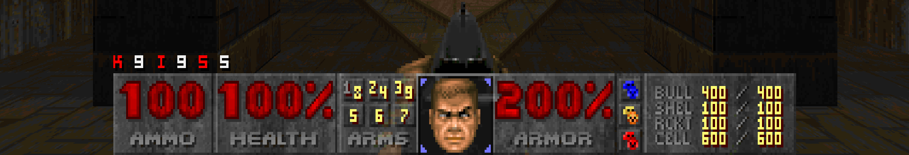
  

**2) Crispy Plus** 
<a href="https://github.com/fabiangreffrath/crispy-doom" target= "_blank">Crispy Doom</a> fullscreen HUD with labels. With additional indicators for Berserk, Chainsaw/Super Shotgun, god mode and armor type. Dynamic ammo label with the "Ammo Names" addon. (By default, slot numbers are used in ammo overview. Addons for ammo names are available below, see "Bonus Content".) 
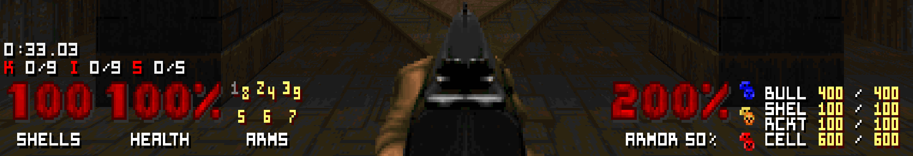
  

**3) Nightdive** 
Replaces the default <a href="https://static.doomworld.com/pages_media/29_lor1.png" target= "_blank">Nightdive fullscreen HUD</a>. Ammo overview, arms display and armor type indicator were added (where possible). 
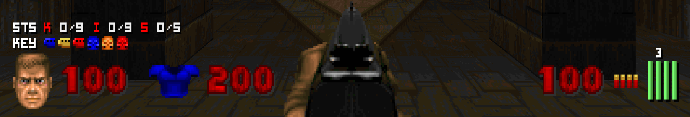
   **I. Plus**: Icons and STTNUM numbers in a single row. Bonus features: Ammo overview meters (four white bars in the bottom right corner) with backpack indicator, Berserk indicator (Berserk pack icon shown in ammo area if fists are selected), Armor icon hidden unless some armor is owned.  
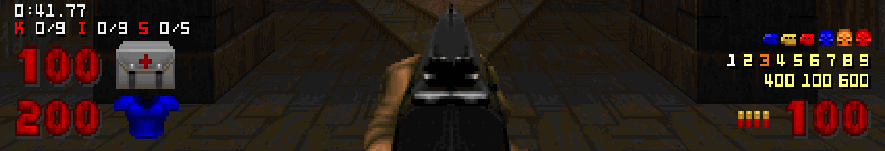
   **II. Stacked**: Focuses on icons instead of labels. Berserker mode indicated by switching health icon. A small label is shown inside the health icon in God mode. Ammo overview hides number for selected weapon. 
<em>Note: Some mods use sprites with different sizes. In such cases, alignment of icons may be off.</em>  
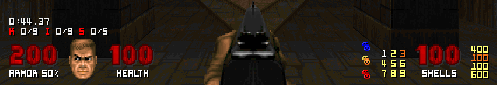
   **III. Labels**: Vitals use the STTNUM font. ARMS display arranged as a square, ammo overview minimized. Dynamic ammo label with the "Ammo Names" addon.  
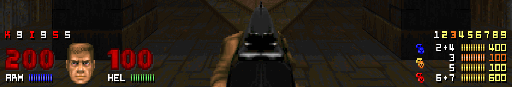
   **IV. Meters**: Ammo overview taken from the DSDA HUD group (with ammo type meters); ARMS widget is a single line.  
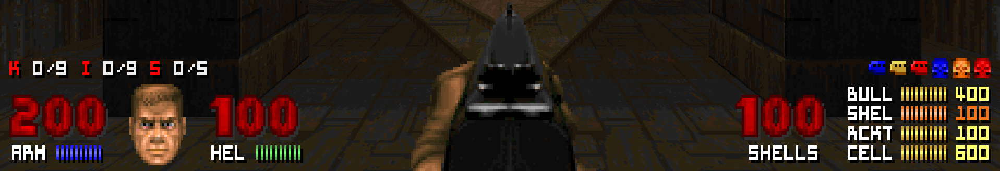
   **V. Invictus**: 'Meters' variant with key bar replacing the ARMS widget and big ammo number. Dynamic ammo label with the "Ammo Names" addon.
  

**4) Doom 64** 
Imitates the fullscreen HUD from <a href="https://www.nintendoworldreport.com/media/51707/1/5.jpg" target= "_blank">Doom 64</a>. Alignment of elements will adjust depending on "Hud Anchoring" setting. 
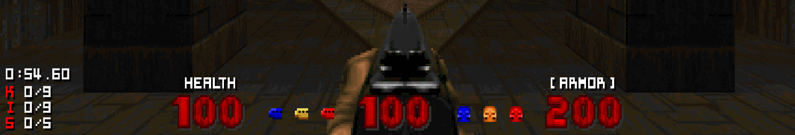
  **I. Original**: Three centered vital stats plus indicators for armor type and god mode.   
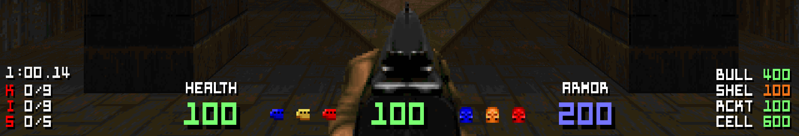
  **II. Boom 64**: Like 'Original', but uses Boom font and its colorization. With ammo overview, active ammo and backpack indicator.
  

**5) Trinity** 
Doom 64 variant with STTNUM vitals arranged on the left side, keeping weapon view unobstructed. 
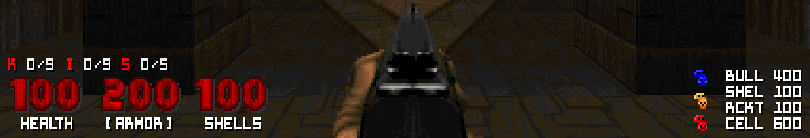
  **I. Mono**: Colorization is avoided (only white, gray and black), making this HUD extremely robust if combined with any custom palettes from PWADs. Alignment of elements will adjust depending on "Hud Anchoring" setting. Dynamic ammo label with the "Ammo Names" addon.  
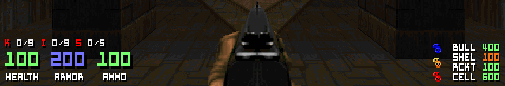
  **II. Color**: Like 'Mono', but with Boom numbers and colorization (same as Boom 64).
    

**6) Eternity** 
Mimicks the fullscreen HUD from the <a href="https://github.com/team-eternity/eternity" target= "_blank">Eternity Engine</a>. 
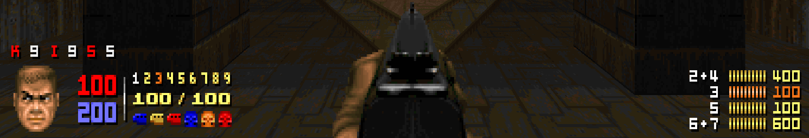
   **I. Enhanced**: Uses original font with different sizes and mugshot. No labels (besides ammo overview).  
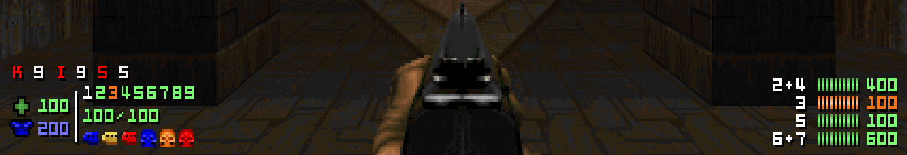
   **II. Boomified**: Uses Boom font instead, one size only, no mugshot. Health/Armor icons indicate Berserk/God modes and MegaArmor (colors depend on selected game), taken from the status bar of <a href="https://doomwiki.org/wiki/Jenesis" target= "_blank">"Jenesis" by Jimmy</a>.
  

**7) Boom** 
The original <a href="https://doomwiki.org/w/images/thumb/5/53/NDCP-map23-end.png/800px-NDCP-map23-end.png" target= "_blank">Boom HUD</a> with properly aligned keys (ignores custom offsets). 
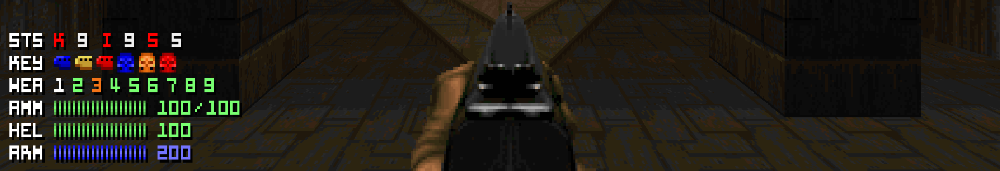
   **I. Compact**: Everything grouped on the left side of the screen.  
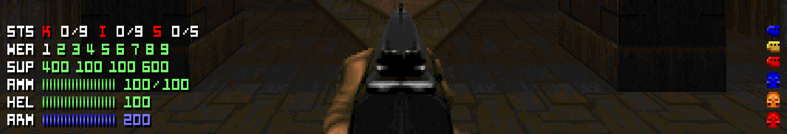
   **II. Supply**: 'Compact' variant with more emphasis on ammo info. The SUP widget shows ammo of all weapons (color-coded, depending on amount in 25% steps: red/orange/gold/green) while the WEA widget won't show active weapons any more, but rather indicate through color how much ammo you still have for each weapon (like SUP). Keys are stacked vertically in the bottom right corner.  
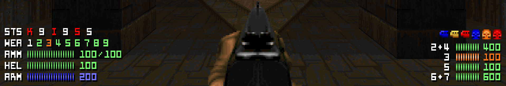
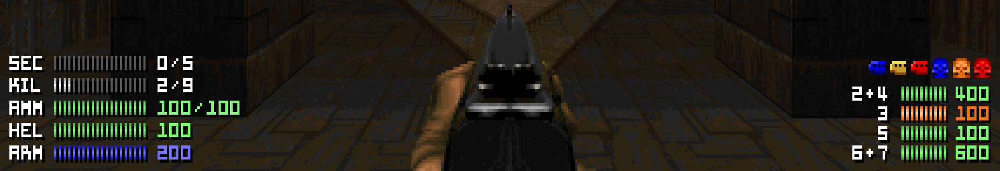
   **III. Remix**: Merges 'Compact' features with ammo overview from Nightdive IV/V. Alternate display mode (second screen): Arms widget (WEA) is replaced with two progress bars for secrets and kills (level stats widget must be set to "Off" or "Automap").  
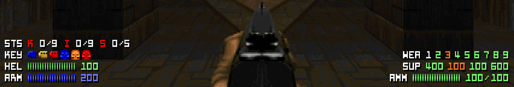
   **IV. Split**: Weapon and ammo-related info move to the right side. Ammo overview taken from 'Supply', otherwise the same as 'Compact'.
  

**8) DSDA** 
Boom variant from the <a href="https://github.com/kraflab/dsda-doom" target= "_blank">DSDA-Doom</a> port. All the vital info is grouped on the left side while ammo overview and keys are to the right. (By default, slot numbers are used in ammo overview. Addons for ammo names are available below, see "Bonus Content".)  
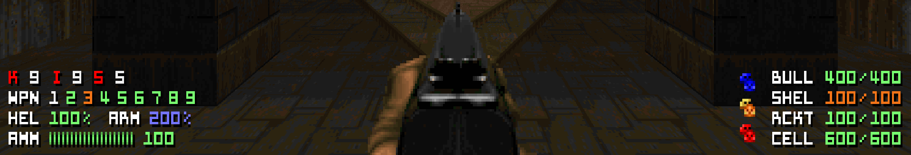
   **I. Standard**: Imitates the original HUD as closely as possible.  
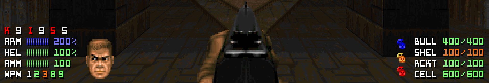
   **II. Enhanced**: Adds mugshot and reorganizes vitals/WPN widgets on the left side.  
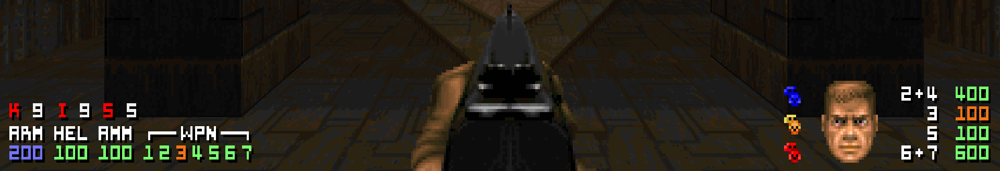
   **III. Condensed**: Widgets on the left are all aligned in a single line. Ammo overview is minimized and mugshot moves to the right side.  

**9) PrBoom+** 
Taken from the <a href="https://github.com/coelckers/prboom-plus/issues" target= "_blank">PrBoom+</a> port, this Boom variant has weapon info and keys on the left while health and armor move to the right, more emphasized by the Doom menu font. The icons change depending on whether you found the Berserk Pack or the Blue Armor. God Mode indicator (label on top of health icon) has been added. 
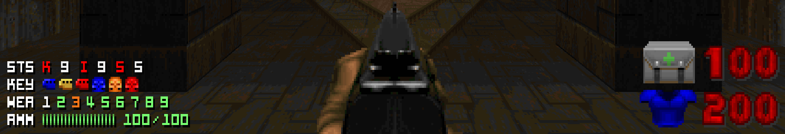
   **I. Standard**: Imitates the original HUD as closely as possible: 'Boom Compact' with Health and Armor isolated on the right side. 
<em>Note: Some mods use sprites with different sizes. In such cases, alignment of icons may be off.</em>
  
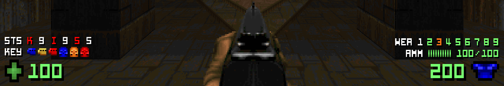
   **II. Balanced**: Uses more neutral/universal icons (from 'Eternity Boomified') and splits them, using a double-sized Boom font. No colorization here (only in the WEA widget for selected weapon).  

**BONUS CONTENT**  
I. Addons (load externally, i.e. NOT via autoload - **currently not all are functional**):
- <a href="https://github.com/NightFright2k19/doom_sbardef/blob/main/extras/ammo_names.pk3" target= "_blank">Ammo Names</a> (Names instead of slot numbers for ammo labels in Crispy and DSDA)
- <a href="https://github.com/NightFright2k19/doom_sbardef/blob/main/extras/gradient.pk3" target= "_blank">Boom Font with Gradient Colors</a> (Check for a <a href="https://i.imgur.com/qdEqwTA.png" target= "_blank">preview here</a>)
- <a href="https://github.com/NightFright2k19/doom_sbardef/blob/main/extras/gradient_names.pk3" target= "_blank">Boom Font with Gradient Colors + Ammo Names</a> (Combines both addons)
 
II. Developer Kit (commented code for all HUDs): 
<a href="https://github.com/NightFright2k19/doom_sbardef/tree/main/docs/sbardef" target= "_blank">Github subpage</a> (Useful for anybody who wants to start with SBARDEF coding on their own)
